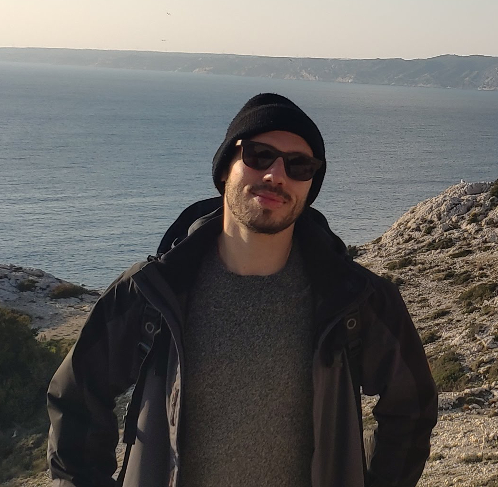

# [Jonas [Mandel]{.lighter-title .char-warning} []{.content-visible when-format="html"}]{.profile-img}
**Senior Bioinformatics Scientist** |  [jonas.mandel@gmail.com](mailto:jonas.mandel@gmail.com) |  [linkedin.com/in/jonasmandel](https://www.linkedin.com/in/jonasmandel/)

##  [About]{.char-color} me
* 14 years of experience in bioinformatics, omics data analysis, machine learning, and clinical biostatistics.
* Expert data analyst for RNAseq, scRNAseq, long-read sequencing, biomarker discovery, GWAS.
* Expert R programmer with working knowledge of Python and extensive use of bioinformatics tools & methods.
* Strong experience in scientific writing and communication with a wide variety of audience (researchers, clinicians, investors).
* Focus areas: immuno-oncology, cardiology, neurology, rare diseases.

##  [Work]{.char-color} Experience

::: {.d-flex .justify-content-between .flex-wrap}
### [Senior Bioinformatics Scientist]{.char-color} - Mnemo Therapeutics
*2021 - 2025, Paris*
:::

* Developed pipelines for detecting alternative splicing and cancer neoantigen prediction using RNAseq, scRNAseq, and long-read RNAseq (PacBio).
* Led statistical analyses of neoantigen recurrence and peptide prioritization for vaccine and CAR-T development.
* Integrated transcriptomics and immunopeptidomics data to generate target libraries; implemented automated reporting.
* Developed long-read RNAseq pipeline for alternative splicing discovery & quantification based on IsoSeq3 & SQANTI.
* Coordinated cross-team efforts as work package lead for immunopeptidomics target mining; prepared scientific deliverables and presentations.

::: {.d-flex .justify-content-between .flex-wrap}
### [Biomarker Biostatistician]{.char-color} - Sanofi / Ividata
*2018 - 2021, Paris*
:::

* Led biomarker analyses in phase 2/3 trials (Sarilumab, Dupilumab, SAR440340) using RNAseq, SNP microarray, and proteomics (olink): statistical analysis plan authoring & implementation with R, oversight of CROs, preparation of deliverables.
* Served as biomarker biostatistician and machine learning advisor in several R&D projects in oncology, cardiology, multiple sclerosis.
* Developed a shiny app for interactive reporting of omics biomarker data analysis.
* Participated in the development of R trainings “Introduction to R” and “Graphs in R” for Sanofi statisticians & programmers.

::: {.d-flex .justify-content-between .flex-wrap}
### [Clinical Biostatistician]{.char-color} - Sanofi / Ividata
*2016 - 2018, Paris*
:::

* GMA Study biostatistician for phase 3b clinical trial (Alirocumab, hypercholesterolemia): authoring SAP and TLFs specs, coordination with CRO & clinical team to prepare of deliverables (KRM, CSR), supervision & QC of CRO’s activities.
* Biostatistician for the Alirocumab publication program: performed data mining and post-hoc analyses across 14 pooled clinical trials to support the development of abstracts, posters, and peer-reviewed publications.

::: {.d-flex .justify-content-between .flex-wrap}
### [Biostatistician & Computational Genomics Scientist]{.char-color} - Pharnext
*2012 - 2015, Paris*
:::

* Built a workflow for GWAS data imputation and analysis to discover disease-specific genomic alterations.
* Designed SAP for Phase II/III clinical trials with adaptive designs, interim futility and power analysis, procedures for multiple endpoints. Meta-analysis of clinical trials.
* Conducted biomarker statistical analysis for in-house clinical trials, including reportings and presentations for internal and external stakeholders (scientific & business).
* Authored abstracts, posters, and peer-reviewed articles.

::: {.d-flex .justify-content-between .flex-wrap}
### [Biostatistics & Bioinformatics research engineer]{.char-color} - Institut Curie / INSERM U900
*2009 - 2012, Paris*
:::

* Performed omics statistical analyses (gene microarray, RNAseq, exome seq, SNP array) for various cancer research projects.
* Developed automated workflows for NGS data analysis and SNP microarray data analysis.
* Co-authored the R package EMA for microarray analysis.
* Participated to developing internal R programming training initiatives.

##  [Education]{.char-color}

### [MS in Bioinformatics and Modelling]{.char-color}
*INSA Lyon, 2003 - 2008*

### [Research internships]{.char-color}
* Cellular automaton modeling of the dynamics of epidemics – *University of Amsterdam, 2008*
* Mathematical modelling of the effect of antibiotic dose on pneumococcus resistance to antibiotics – *Institut Pasteur, 2007*

### [Trainings]{.char-color}
Time management (*Cegos, 2024*), Project management with Git & GitHub (*ArData, 2022*), Docker (*Aneo, 2023*), Machine learning & DataViz in Python (*DataScientest, 2020*).

##  [Skills]{.char-color}

### [Biostatistics & Data Science]{.char-color}
* Statistical modelling & inference: generalized linear model, mixed effects model, survival analysis, meta-analysis, PLS, principal component regression, interim analysis for clinical trials, conditional power analysis
* Multivariate statistics: PCA, PLS, t-SNE, UMAP, multiple correspondence analysis, factor analysis
* Machine learning: supervised classification & regression (LDA, SVM, Lasso / Elastic Net, boosting, bagging, random forests, XGBoost, …), unsupervised clustering (hierarchical clustering, k-means, DBSCAN, gaussian mixture models, …)

### [Omics & Bioinformatics]{.char-color}
* Transcriptomics (RNAseq, scRNAseq): alignment, normalization, differential analysis, splicing detection & quantification
* Long-read sequencing (PacBio): transcript identification, isoform quantification, differential analysis
* Genomics (WGS/WES): variant calling, CNV analysis, fusion gene detection
* SNP microarrays & GWAS: imputation, association testing
* Pathway enrichment analysis, GSA/GSEA

### [Bioinformatics tools & workflows]{.char-color}
* tools: STAR, Seurat, StringTie, Samtools, NetMHCpan, DeepTMHMM, PLINK, IsoSeq3, SQANTI, tappAS, BLAST
* workflows development: Nextflow, Docker, Galaxy

### [Programming & DataViz]{.char-color}
R (tidyverse, ggplot2, mlr3, data.table, RMarkdown, Shiny), Python (pandas, seaborn, scikit-learn, matplotlib)

### [Collaboration & Project Management]{.char-color}
Git/GitHub, Trello, Teams, agile coordination, cross-functional communication

### [Languages]{.char-color}
English (fluent), French (native), Spanish (good)

##  [Interests]{.char-color}
* Theater & acting
* Hiking / running
* Sociology, philosophy
* Science fiction litterature

##  [Publications]{.char-color}
_Combinational Drug Repurposing from Genetic Networks Applied to Alzheimer's Disease._
Nabirotchkin S, Bouaziz J, Glibert F, Mandel J, Foucquier J, Hajj R, Callizot N, Cholet N, Guedj M, Cohen D. J Alzheimers Dis. 2022;88(4):1585-1603. doi: 10.3233/JAD-220120.
